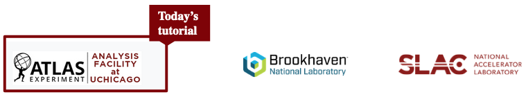
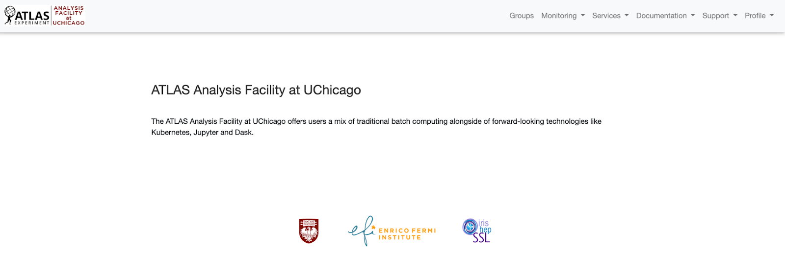

US ATLAS has three shared Tier 3 analysis facilities providing software & computing resources, one of the most recent is located at The University of Chicago and was pre-launched in October 2021.

**
 Funded by NSF (Natural Science Foundation) and co-located with MWT2-UC 
**

- Large login nodes for develpment & batch pools or larger-scale processing
- Storage for local datasets & XCache for remote datasets
- Access to ATLAS & analysis software and tools

Broad range of activities carried out & supported at the facilities, including:
- Event generation, detector simulation with ATLAS or standalone software
- Data movement (via R2D2) and access (using Xcache)
- Data processing for analysis & statistics using ATLAS software in CVMFS
- Graphical applications for example via X-windows
- Software development, testing code before submitting to batch system or Panda
- Supported for Run 3 but also allow for R&D for the future

> ## Software & Computing Resources
> - Resources that fill gaps between grid jobs and interactive analysis on local computers
> - ssh access and HTCondor batch
> - Simple Jupyter notebook scheduling to CPU and GPU
> - Coffea-Casa, ServiceX (IRIS-HEP tools for columnar analysis)
> - Interactive access: interactive nodes, containers, node flavors
> - Processing interfaces: HTCondor access, shared endpoint.
> - ~1000 cores co-located and close integration with  MWT2. ~1 petabyte of storage
> - Users start with: 5TB $DATA, 100GB $HOME, 1500 shared CPU cores, shared GPUs.
{: .callout}

> ## Contact info
>
> - Join our  <a href="https://atlas-talk.sdcc.bnl.gov/"> US-ATLAS Discourse Forum</a> for help, questions, comments, user support, newsletter and more!. 
>
> - Check the <a href="https://usatlas.readthedocs.io/projects/af-docs/en/latest/">public documentation for US-ATLAS Analysis Facilities</a>
>
> - Besides the user support platforms for questions and comments, you can send an email to mduranosuna@niu.edu
{: .callout}


