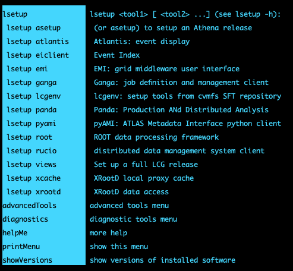

> ## Main steps
>
> - <a href="#atlasenv">Setup the ATLAS environment</a>
>
> - <a href="#certificate">Accessing ATLAS data: your 509 Proxy Certificate</a>
>
> - <a href="#login">Read data from Rucio </a>
{: .callout}

<!------------------------------------------------------------------------------------->
<!------------------------------ atlas environment -------------------------------------->

<h2 id="account"> Set up the ATLAS environment </h2>

Now that you logged into the analysis facility, to load ATLAS environment, add the following lines a shell script `myatlasenv.sh`. 

~~~bash
#!/bin/bash
export ATLAS_LOCAL_ROOT_BASE=/cvmfs/atlas.cern.ch/repo/ATLASLocalRootBase
export ALRB_localConfigDir=$HOME/localConfig
source $ATLAS_LOCAL_ROOT_BASE/user/atlasLocalSetup.sh
~~~
{: .language-bash}
{: .output}

Run the script to set up ATLAS environment and look at the image with the output.
~~~bash
 source myatlasenv.sh
 # at this point, you can lsetup root, rucio, athena, etc.
~~~

{:width="600"}

## Accessing ATLAS data: your X509 proxy certificate

If you need to access ATLAS Data, you will need to copy your X509 certificate to the Analysis Facility. Store your certificate in $HOME/.globus and do:

* note: if the extension of your certificate is `.p12`, just replace `.pfx` with `.p12` *

~~~bash
# on the command line:
mkdir ~/.globus #in case the directory doesn't exist.
cp mycertificate.pfx ~/.globus && cd ~/.globus
openssl pkcs12 -in <yourcertificate_name.pfx> -clcerts -nokeys -out usercert.pem 
# enter your import password:
# ...
openssl pkcs12 -in <yourcertificate_name.pfx> -nocerts -out userkey.pem
# enter your import password:
# ...
# enter your PEM pass phrase: 
# ...
chmod 400 userkey.pem
chmod 444 usercert.pem
cd - #go back to your home area /home/<user_name>
~~~~
{: .language-bash}

Now create an ATLAS VOMS proxy in the usual way:

~~~bash
# on the command line
voms-proxy-init -voms atlas
# Enter GRID pass phrase for this identity:
# ...
lsetup emi
voms-proxy-init -voms atlas -out $HOME/x509proxy
# Enter GRID pass phrase for this identity:
# ...
~~~~
{: .language-bash}

<!------------------------------------------------------------------------------------->
<!------------------------------ data from rucio --------------------------------->

<h2 id="rucio">Read data from Rucio</h2>

This is an example to read data from rucio, pretend to process it, and then push a small copied back to the $HOME filesystem. It assumes your X509 proxy certificate is valid and in your home directory.

Run the following lines from the command line, (be sure that you already call your file `myatlasenv.sh`, you only have to do this once per session)

~~~bash
lsetup rucio
rucio --verbose download --rse MWT2_DATADISK data16_13TeV:AOD.11071822._001488.pool.root.1

# You can run things like asetup as well
asetup AnalysisBase,21.2.81

# This is where you would do your data analysis via AnalysisBase, etc. And actually,
# once setting up rucio, we should exit before setting up an AnalysisBase release.  We will
# just pretend to do that, and truncate the file to simulate generating an
# output file. This is definitely not what you want to do in a real analysis!
cd data16_13TeV
truncate --size 10MB AOD.11071822._001488.pool.root.1
cp AOD.11071822._001488.pool.root.1 $HOME/myjob.output
~~~~

{: .language-bash}

<!------------------------------------------------------------------------------------->
<!------------------------------  --------------------------------->

<!----------------------------------- fin --------------------------------------------->


